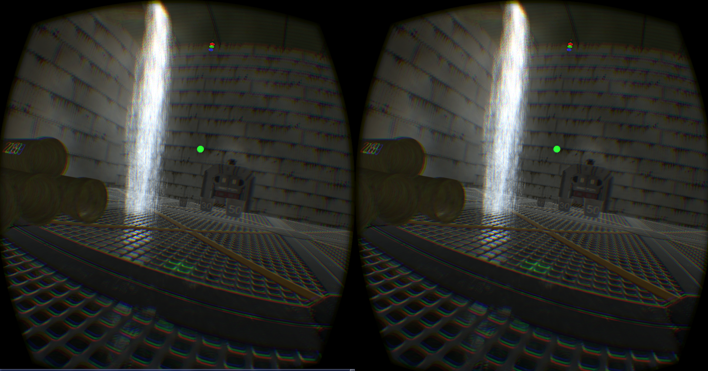

#Marmotte World

A serious game made with Unity3D (5.1) for the Virtual Reality course at UQAC (prof: M. MENELAS).


##Authors

* Steven GERARD
* Taiki HAGIWARA
* Corentin RAOULT

##Story

You were in jail of a mad scientist but managed to escape and now you are in sewers.
But it's dangerous to go alone, you are accompanied with Fluffy, a marmot who can speak due to expermiments of the mad scientist.
To go outside you have to success in different puzzles with math.

##Virtual Reality

This game use a HMD (Head-Mounted Display, the Oculus Rift DK2) and an haptic arm (the Novint Falcon), we used 3D sound too, so for a better experience, we suggest having a headset.

##Controls

* Keyboard
	* W : go forwad
	* A : rotate Left
	* S : go to the back
	* D : rotate Right

* HMD
	* Turn your head to turn the head of your character

* Haptic arm
	* Use this device to move the green sphere and take/push differents objects


## How to build

1. Download the project.

2. Download and install the [Oculus Runtime for Windows](https://developer.oculus.com/downloads/).

3. Download and run the [UnityFalcon server](https://github.com/kbogert/falconunity/releases) to make the haptic arm communicate with Unity.

4. Build with Unity and run the ```directToRift``` executable.

##Screenshots



##Gameplay Videos

<div style="text-align:center" markdown="1">

<a href="http://www.youtube.com/watch?feature=player_embedded&v=oq7FxAcPToM
" target="_blank"></a>

<a href="https://www.youtube.com/watch?v=WsS6Mqccvv8&feature=youtu.be
" target="_blank"></a>

</div>


##Note

Assets used for the game where finded on the [Unity Asset Store](https://www.assetstore.unity3d.com/en/?gclid=CKG8jvbktcYCFYU6aQodC44OLA#!/home) and the marmot 
picture is from [ZeMarmot project](http://film.zemarmot.net/fr/). 
